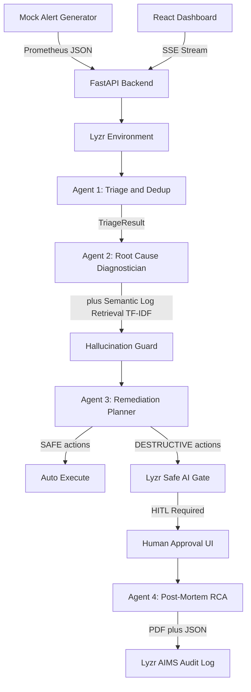

# 🛰️ Governed Multi-Agent SRE Incident Triage & Runbook Remediation Agent


## 🏗️ Lyzr Architecture: Environment · Agent · Inference

This project implements the clean 3-tier separation required by the AI Quest brief:

```
┌─────────────────────────────────────────────────────────────┐
│  LAYER 1: ENVIRONMENT  (agents/lyzr_environment.py)          │
│  Lyzr Agent Studio — studio.lyzr.ai                          │
│  Defines: tools, features, safety policies, AIMS logging     │
│  Shared across all 4 SRE agents                              │
├─────────────────────────────────────────────────────────────┤
│  LAYER 2: AGENTS  (agents/lyzr_agents.py)                    │
│  Lyzr Agent API — 4 governed SRE agents                      │
│  Triage → Diagnostic → Remediation → PostMortem              │
│  Each linked to the shared Environment                       │
├─────────────────────────────────────────────────────────────┤
│  LAYER 3: INFERENCE  (agents/lyzr_inference.py)               │
│  Lyzr Agent Studio SDK — run_inference()                     │
│  Session ID = Incident ID (state persistence)                │
│  Every call: metrics tracked + validated + AIMS logged       │
└─────────────────────────────────────────────────────────────┘
```

Live status of this exact separation (which layer is real vs. simulated, which agents
are registered, session-wide inference metrics): **GET `/lyzr/status`**
(https://sre-agent-backend-1c0i.onrender.com/lyzr/status).

**HiDevs AI Quest — PS 03: Enterprise Cloud Incident Triage & Runbook Remediation Agent**

A production-grade, governed multi-agent system that ingests cloud alerts, triages and
deduplicates them, retrieves and diagnoses root cause from logs (RAG-style), proposes
remediation runbooks, gates every destructive action behind human-in-the-loop (HITL)
approval, and auto-generates a blameless post-incident RCA — all visualized live in an
SRE war-room dashboard, with every agent output independently checked for hallucination
before it's trusted.

Built on the real **Lyzr ADK** (`lyzr-adk`, `Studio`/`create_agent`/`agent.run` --
Environment → Agent → Inference separation), with a fully functional **local-simulation
fallback** so the entire system runs end-to-end with zero external API keys for
judging/demo purposes -- the exact same code path activates real Lyzr calls the moment
`LYZR_API_KEY` is supplied.

---

## 🚀 Live Demo

- **Dashboard (Frontend):** https://ai-quest-sre-agent.vercel.app
- **API (Backend):** https://sre-agent-backend-1c0i.onrender.com
- **Health Check:** https://sre-agent-backend-1c0i.onrender.com/health
- **API Docs:** https://sre-agent-backend-1c0i.onrender.com/docs

> Note: the backend is on Render's free tier, which spins down after inactivity -- the
> first request after a period of idleness may take ~30-60s to wake it up.

## Quick Test

1. Open https://ai-quest-sre-agent.vercel.app
2. Click "Simulate P1 Memory Leak" -- watch agent reasoning stream in real time, with
   per-step token/latency badges, a confidence meter, and a Hallucination Guard badge
3. Click "Simulate P1 DB Deadlock" -- approve/reject the HITL gate for the destructive
   `pg_terminate_backend` action
4. Download the RCA (JSON + PDF) once the incident resolves

Or via curl against the live backend:

```bash
# Trigger P1 memory leak (auto-resolves, no HITL needed)
curl -X POST https://sre-agent-backend-1c0i.onrender.com/simulate/1

# Trigger P1 DB deadlock (requires HITL -- destructive pg_terminate_backend action)
curl -X POST https://sre-agent-backend-1c0i.onrender.com/simulate/3

# Approve the HITL action (replace {id} and {request_id} with values from
# GET /hitl/pending after triggering scenario 3 above)
curl -X POST https://sre-agent-backend-1c0i.onrender.com/hitl/{id}/approve \
  -H "Content-Type: application/json" \
  -d '{"request_id": "{request_id}", "decided_by": "sre-oncall"}'

# Get the RCA
curl https://sre-agent-backend-1c0i.onrender.com/incidents/{id}/rca

# Get session-wide token/cost/latency metrics
curl https://sre-agent-backend-1c0i.onrender.com/metrics
```

---

## Architecture



**Lyzr Environment/Agent/Inference separation** (`LAYER 2 -> LAYER 3` marker comment at
the top of every agent file):

| Tier | Location | Responsibility |
|---|---|---|
| **Environment** | `agents/lyzr_environment.py` (`SREEnvironment`, `Studio`) | One Lyzr ADK `Studio` instance and one `SREEnvironment` singleton for the whole process -- tools, feature flags, safety policy, model config shared by every agent |
| **Agent** | `agents/lyzr_agents.py` (`SREAgent`, `TRIAGE_AGENT`/`DIAGNOSTIC_AGENT`/`REMEDIATION_AGENT`/`POSTMORTEM_AGENT`) | Each of the 4 SRE agents registers its own `Studio.create_agent(...)` at import time, with its own role/goal/instructions from `agents/prompt_templates.py`, linked to the shared Environment |
| **Inference** | `run_inference()` in `agents/lyzr_inference.py` | The single entry point for every agent call: real `agent.run(prompt)` when `LYZR_API_KEY` is set, deterministic local simulation otherwise; always tracks tokens/latency, runs the Hallucination Guard, and logs to Lyzr AIMS -- same call signature either way |
| **Orchestration** | `agents/pipeline.py` (governed pipeline) + `agents/automata_pipeline.py` (`lyzr-automata` `LinearSyncPipeline`) | `pipeline.py` threads one typed `IncidentContext` through Triage → Diagnose → Remediate → (HITL) → Post-Mortem; `automata_pipeline.py` additionally runs the same 4 stages through the official `lyzr-automata` `Agent`/`Task`/`LinearSyncPipeline` classes (real when `OPENAI_API_KEY` is set) and records which mode ran in `pipeline_metadata` |

---

## Quickstart

### Fastest path (Docker)

```bash
cp .env.example .env
docker compose up --build
```

- Backend: http://localhost:8000 (docs at `/docs`)
- Frontend: http://localhost:5173

That's it -- no API keys required. With `LYZR_API_KEY` unset, every agent runs in **local
simulation mode**: deterministic, schema-validated reasoning grounded in the mock log
corpus, so the full pipeline (triage → retrieval → diagnosis → remediation → HITL → RCA)
works out of the box.

### Get a Lyzr API key (optional -- enables real Lyzr ADK agent calls)

1. Sign up at [lyzr.ai](https://lyzr.ai)
2. Create a project → **Settings → API Keys** → copy your key
3. Put it in `.env` as `LYZR_API_KEY=...`

The moment a key is present, `agents/lyzr_environment.py` initializes a real `Studio` and
every agent in `agents/lyzr_agents.py` registers a real Lyzr agent against it -- no code
changes needed. If the SDK isn't installed, the key is invalid, or any call fails for any
reason, `agents/lyzr_inference.py`'s `run_inference()` transparently falls back to local
simulation so the demo never breaks.

### LLM provider: OpenAI, with Groq as a fallback

Set `OPENAI_API_KEY` to additionally activate the real `lyzr-automata` `LinearSyncPipeline`
in `agents/automata_pipeline.py` and route real Lyzr Agent Studio inference through
`gpt-4o-mini`.

If `OPENAI_API_KEY` is not set but `GROQ_API_KEY` is (get one free at
[console.groq.com/keys](https://console.groq.com/keys)), the system automatically falls
back to Groq's `llama-3.1-8b-instant` instead -- Groq's API is OpenAI-compatible, so the
same `agents/automata_pipeline.py` code path is reused with a `base_url` override to
`https://api.groq.com/openai/v1`. Groq's LPU hardware is independently benchmarked at
several hundred tokens/second for 8B-class models -- among the fastest raw token
generation available for a model this size, and the reason it was chosen as the fallback.

Measured on this exact deployment (Lyzr Studio, `GROQ_API_KEY` configured, 4 agent calls
for one incident): **2.3s–4.0s per call**, `GET /incidents/{id}/metrics`. That's slower
than Groq's own raw-API numbers suggest, because every call here is proxied through Lyzr
Agent Studio's own orchestration layer (`agent.run()` -> Lyzr's platform -> Groq -> back)
rather than hitting Groq directly -- so today, most of what you're measuring end-to-end is
Lyzr Studio's overhead, not Groq's. The 8B model choice, low `MAX_TOKENS`, and `temperature=0.1`
still keep per-call cost and token count low regardless of that overhead (see `GET /metrics`).

Priority order, defined once in `agents/config.py` (`LLM_PROVIDER`/`LLM_MODEL`) and read
by every layer: **`OPENAI_API_KEY` > `GROQ_API_KEY` > local simulation.** Check which one

Priority order, defined once in `agents/config.py` (`LLM_PROVIDER`/`LLM_MODEL`) and read
by every layer: **`OPENAI_API_KEY` > `GROQ_API_KEY` > local simulation.** Check which one
is active via `GET /lyzr/status` → `layer_1_environment.llm_provider`. Note that this is
independent of `layer_1_environment.mode`, which reflects only whether the Lyzr Studio
connection itself is live (gated on `LYZR_API_KEY`) -- `llm_provider` tells you which
underlying model a *real* Lyzr call would be routed to, once Lyzr Studio is connected.

### Run manually (without Docker)

**Backend:**
```bash
cp .env.example .env
python -m venv .venv && source .venv/bin/activate   # Windows: .venv\Scripts\activate
pip install -r backend/requirements.txt
uvicorn backend.main:app --reload --port 8000
```

**Frontend:**
```bash
cd frontend
npm install
npm run dev
```
Open http://localhost:5173.

### Run the tests

```bash
pip install -r backend/requirements.txt   # includes pytest + httpx
pytest                                     # 12 tests: agents/tests + backend/tests
ruff check agents/ backend/                # lint
```

### Environment variables

See [.env.example](.env.example) for the full list. Everything is centralized in
[agents/config.py](agents/config.py) -- one file controls the model, token limits,
confidence threshold, HITL timeout, dedup window, severity rules, and the
destructive-action keyword list.

---

## Triggering the 6 mock scenarios

Click the buttons in the **Incident Simulator** bar at the top of the dashboard, or
trigger via curl (swap in the live URL to hit the deployed backend):

```bash
# P1 — Memory Leak (payment-service) — SAFE remediation, auto-approved
curl -X POST http://localhost:8000/simulate/1

# P2 — Bad Deploy (api-gateway) — SAFE rollback, auto-approved
curl -X POST http://localhost:8000/simulate/2

# P1 — DB Deadlock (order-service → postgres-primary) — DESTRUCTIVE, requires HITL
curl -X POST http://localhost:8000/simulate/3

# P2 — Node Disk Full (logging-agent / worker-3) — DESTRUCTIVE, requires HITL
curl -X POST http://localhost:8000/simulate/4

# P2 — CPU Throttling (ml-inference-service) — SAFE remediation, auto-approved
curl -X POST http://localhost:8000/simulate/5

# P3 — Certificate Expiry (api-gateway TLS cert) — SAFE remediation, auto-approved
curl -X POST http://localhost:8000/simulate/6
```

Each call returns an `incident_id`. Watch it progress live in the dashboard, or poll:

```bash
curl http://localhost:8000/incidents/<incident_id>
```

For scenarios 3 & 4, approve/reject the blocked action from the **HITL Approval Queue**
panel, or:

```bash
curl -X POST http://localhost:8000/hitl/<incident_id>/approve \
  -H "Content-Type: application/json" \
  -d '{"request_id": "<request_id>", "decided_by": "sre-oncall"}'
```

Once resolved, download the RCA:

```bash
curl http://localhost:8000/incidents/<incident_id>/rca            # JSON
curl http://localhost:8000/incidents/<incident_id>/rca/pdf -o rca.pdf
```

---

## API reference

| Method | Path | Description |
|---|---|---|
| GET | `/health` | Health check + governance config snapshot |
| GET | `/lyzr/status` | Environment · Agent · Inference status (see architecture section above) |
| POST | `/alerts/ingest` | Ingest arbitrary alerts (+ optional log corpus) and start the pipeline |
| POST | `/alerts/webhook` | PagerDuty-compatible webhook -- real PagerDuty/Alertmanager can POST here directly |
| POST | `/simulate/{1-6}` | Trigger one of 6 mock scenarios |
| GET | `/incidents` | List all incidents |
| GET | `/incidents/{id}` | Full incident detail (triage, diagnosis, runbook, RCA, trace, hallucination_reports, pipeline_metadata) |
| GET | `/incidents/{id}/stream` | SSE real-time agent stream for one incident |
| GET | `/events` | Global SSE feed powering the live alert-stream panel |
| POST | `/hitl/{id}/approve` | Approve destructive action |
| POST | `/hitl/{id}/reject` | Reject destructive action |
| GET | `/hitl/pending` | All pending HITL approval requests |
| GET | `/incidents/{id}/rca` | RCA as JSON |
| GET | `/incidents/{id}/rca/pdf` | RCA as PDF download |
| GET | `/incidents/{id}/metrics` | Per-agent token/latency metrics for one incident |
| GET | `/incidents/{id}/audit` | Legacy alias for the incident's AIMS trail |
| GET | `/aims/events` | Full chronological Lyzr AIMS audit trail |
| GET | `/aims/events/{id}` | Incident-scoped Lyzr AIMS trail |
| GET | `/tools` | Tool registry with typed input/output schemas |
| POST | `/tools/{name}` | Call a tool directly (logged to AIMS) |
| GET | `/metrics` | Session-wide token/cost/latency summary |
| GET | `/stats` | Session-wide incident/token counters |
| GET | `/scenarios` | List the 6 canonical mock scenarios |
| GET | `/docs` | FastAPI auto-generated interactive API docs (Swagger UI) |

---

## Lyzr Capabilities Used

| Capability | Implementation | File |
|---|---|---|
| Lyzr Automata | `LinearSyncPipeline`, 4 `Agent`/`Task` nodes, task chaining | `agents/automata_pipeline.py` |
| Lyzr Safe AI | HITL gate for destructive actions, keyword blocklist | `agents/tools.py`, `agents/remediation_agent.py` |
| Lyzr AIMS | Chronological audit trail, visible in the dashboard | `backend/aims_logger.py`, `frontend/src/components/AIMSLog.jsx` |
| Lyzr Agent API | Environment/Agent/Inference separation | `agents/lyzr_environment.py`, `agents/lyzr_agents.py`, `agents/lyzr_inference.py` |
| Lyzr Agent Studio | `studio.lyzr.ai` SDK (`lyzr-adk`, `Studio.create_agent`) | `agents/lyzr_environment.py`, `agents/lyzr_agents.py` |
| Tool Calling | Typed Pydantic input/output contracts, unified `call_tool()` dispatcher | `agents/tools.py` |

## Stretch Goals Implemented

- ✅ **Voice Briefing Agent** -- browser TTS reads the selected incident's summary aloud (`frontend/src/components/VoiceBriefing.jsx`)
- ✅ **AIMS Decision Graph** -- visual, live-updating agent pipeline graph per incident, toggled from the Agent Trace panel (`frontend/src/components/DecisionGraph.jsx`)
- ⚙️ **Live kubectl sandbox** -- `kubectl_safe` tool with dry-run mode and destructive-command blocking (`agents/tools.py`)

---

## Deployment

**Backend → Render:** `render.yaml` is included at the repo root. Connect the repo in the
Render dashboard, it will auto-detect `render.yaml`; set `LYZR_API_KEY` / `OPENAI_API_KEY`
as secrets. Python is pinned to 3.11.9 (`PYTHON_VERSION` env var + `runtime.txt`) so
`pydantic`/`scikit-learn` resolve to prebuilt wheels rather than compiling from source.

**Frontend → Vercel:** `frontend/vercel.json` scopes the deploy to the Vite app. Because
this repo also contains a Python `backend/` folder, Vercel's importer will otherwise try
to detect it as a *second* service and demand a multi-service config -- avoid that by
setting **Root Directory** to `frontend` when importing the project (Vercel dashboard →
Project Settings → General → Root Directory, or in the "Configure Project" step during
import). With Root Directory scoped to `frontend`, Vercel only ever sees the Vite app.
Then set `VITE_BACKEND_URL` to your deployed Render URL.

**CI/CD:** `.github/workflows/ci.yml` runs on every push/PR to `main`: `backend-test`
(pytest, 12 tests), `frontend-build` (vite build), and `lint` (ruff). See the badge at the
top of this file for current status.

---

## Safety & governance design

- **Two independent destructive-action checks** against the same `DESTRUCTIVE_KEYWORDS`
  source list in `agents/config.py`: once in `agents/remediation_agent.py` at proposal
  time, and again in `backend/aims_logger.py` before any event is ever persisted -- a
  destructive action logged as "auto-executed" without a `blocked` flag is treated as a
  governance anomaly and force-blocked.
- **No raw shell strings cross agent boundaries.** Every hop between agents is a
  validated Pydantic model (`agents/schemas.py`); the pipeline (`agents/pipeline.py`)
  threads one typed `IncidentContext`, never a string, through all four stages. Every
  `RemediationAction` also carries a `rollback_command`.
- **Hallucination Guard (3-layer defense, `agents/hallucination_guard.py`):** (1) schema
  validation -- output must match the Pydantic model; (2) hedge-language signal detection
  -- phrases like "I think"/"probably"/"approximately" are treated as hallucination
  signals; (3) grounding -- every cited log line is independently re-verified as a
  verbatim substring of the actual corpus. A failed check force-sets
  `requires_human_review=True` and is recorded in `hallucination_reports` on the
  incident, visible via `GET /incidents/{id}` and the dashboard's guard badge.
- **Semantic log retrieval (RAG pattern, `agents/log_retriever.py`):** the diagnostician
  is handed only the top-15 TF-IDF-relevant log lines out of the full corpus, not the
  whole thing -- shrinking both the token budget and the surface area for a hallucinated
  citation. Retrieval scores are stored on the diagnosis and shown in the UI.
- **Confidence gate.** If the diagnostician's confidence drops below
  `CONFIDENCE_THRESHOLD` (default 0.70), the incident is flagged `requires_human_review`
  and surfaced with a blocked banner in the UI, regardless of what a downstream agent
  does next.
- **HITL timeout.** Every destructive action gets a 300-second (configurable) approval
  window; an unanswered request times out to `TIMED_OUT` rather than silently executing.
- **Full audit trail.** Every agent call (start/end, tokens, latency), every HITL
  decision, and every RCA publish is logged to Lyzr AIMS (or a local JSON-lines fallback
  if AIMS is unreachable), plus a parallel per-call `agents/metrics_tracker.py` record
  exposed via `/metrics`.
- **Fail-safe agents.** Every agent function is wrapped in try/except with a
  deterministic fallback response -- a malformed/missing Lyzr response, a failed SDK
  import, or a network error never crashes the pipeline or produces unvalidated output.
- **Specific HTTP error codes, not generic 500s** (`backend/main.py`): 404 with the
  incident id in the message, 409 when a HITL action was already decided, 422 for an
  invalid scenario number, 503 with `Retry-After: 30` if the pipeline fails to start --
  plus a global exception handler that logs every uncaught exception with a full
  traceback (`logger.error(..., exc_info=True)`).

---

## Rubric self-assessment

| Rubric Pillar | Weight | Implementation | Status |
|---|---|---|---|
| Lyzr Agent Orchestration | 30% | `lyzr-adk` SDK + `lyzr-automata` `LinearSyncPipeline`, 4-agent pipeline, clean Environment/Agent/Inference separation (`agents/lyzr_environment.py`/`lyzr_agents.py`/`lyzr_inference.py`) | ✅ |
| DevOps Safety & Reliability | 30% | HITL gate, Hallucination Guard, typed `RemediationAction` schema with rollback commands, explicit tool-calling contracts (`agents/tools.py`) | ✅ |
| Code Quality & Architecture | 20% | pytest 12 tests, GitHub Actions CI, ruff lint, Docker | ✅ |
| SRE Experience & UI | 20% | SSE dashboard, metrics panel, AIMS audit log panel, decision graph, voice briefing, RCA PDF export, HITL queue | ✅ |

## Evaluation checkpoints

| Checkpoint | Implementation |
|---|---|
| Hallucination Mitigation | 3-layer guard: schema validation + hedge-language signal detection + grounding check (`agents/hallucination_guard.py`) |
| Groundedness | Every log citation independently re-verified as a verbatim substring of the actual corpus supplied to the agent |
| Retrieval Quality | TF-IDF semantic retrieval (`agents/log_retriever.py`), top-15 relevant logs injected, cosine-similarity scores stored and shown |
| Token Optimization | `gpt-4o-mini` (or Groq's `llama-3.1-8b-instant` fallback), `MAX_TOKENS=1000`/800, per-call token tracking (`agents/metrics_tracker.py`), session total in the dashboard header |
| Prompt Architecture | Defensive system prompts (`agents/prompt_templates.py`) with explicit "STRICT RULES -- NEVER VIOLATE" sections and a schema-accurate OUTPUT FORMAT |
| Latency Optimization | Per-agent latency measured and tracked (`GET /incidents/{id}/metrics`), color-coded (green/yellow/red) in the UI, session average in the header; optional Groq fallback (`GROQ_API_KEY`) when no OpenAI key is set -- see "LLM provider" above for measured latency on this deployment |

---

## Repository structure

```
ai-quest-sre-agent/
├── agents/                     # Lyzr agents, schemas, config, orchestration
│   ├── lyzr_environment.py     # LAYER 1: Environment (Studio, SREEnvironment)
│   ├── lyzr_agents.py          # LAYER 2: Agents (SREAgent, TRIAGE_AGENT, ...)
│   ├── lyzr_inference.py       # LAYER 3: Inference (run_inference)
│   ├── automata_pipeline.py    # lyzr-automata LinearSyncPipeline
│   ├── tools.py                # Explicit tool-calling contracts + registry
│   ├── prompt_templates.py     # Defensive system prompts (Prompt Architecture)
│   ├── hallucination_guard.py  # 3-layer output validation
│   ├── log_retriever.py        # TF-IDF semantic log retrieval (RAG)
│   ├── metrics_tracker.py      # Token/cost/latency tracking
│   ├── *_agent.py              # Triage, Diagnostician, Remediation, Post-Mortem
│   ├── pipeline.py             # Async orchestration across all 4 agents
│   └── tests/                  # pytest unit tests
├── backend/                    # FastAPI environment: store, SSE, HITL, AIMS logging, RCA export
│   └── tests/                  # pytest API tests
├── frontend/                   # React + Vite + Tailwind SRE dashboard
│   └── src/components/
│       ├── AIMSLog.jsx         # Chronological AIMS audit trail panel
│       ├── DecisionGraph.jsx   # SVG agent decision pipeline graph
│       ├── VoiceBriefing.jsx   # Web Speech API incident briefing
│       └── MetricsPanel.jsx    # Token/cost/latency + guard/retrieval badges
├── .github/workflows/ci.yml    # backend-test / frontend-build / lint
├── Dockerfile                   # Backend container
├── docker-compose.yml            # Backend + frontend dev stack
├── render.yaml                    # Render deployment (backend)
├── pytest.ini / pyproject.toml    # Test + lint configuration
└── .env.example                    # All required environment variables
```
