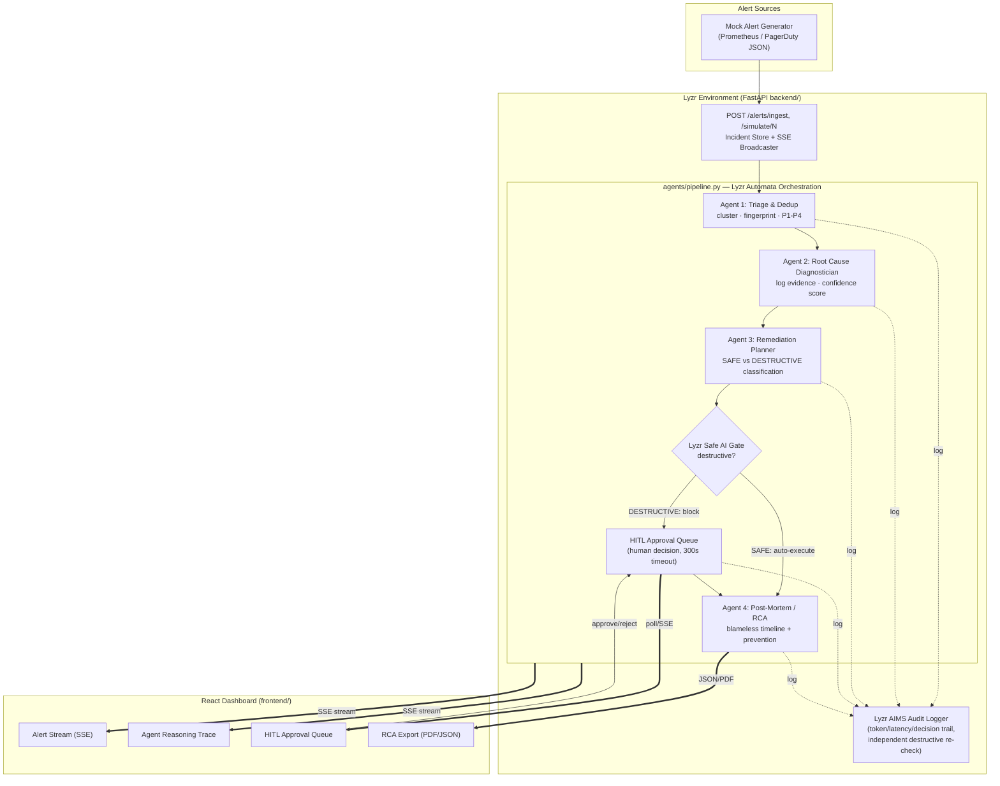

# 🛰️ Governed Multi-Agent SRE Incident Triage & Runbook Remediation Agent

**HiDevs AI Quest — PS 03: Enterprise Cloud Incident Triage & Runbook Remediation Agent**

A production-grade, governed multi-agent system that ingests cloud alerts, triages and
deduplicates them, diagnoses root cause from logs, proposes remediation runbooks, gates every
destructive action behind human-in-the-loop (HITL) approval, and auto-generates a blameless
post-incident RCA — all visualized live in an SRE war-room dashboard.

Built on the **Lyzr Agent API** (Environment → Agent → Inference separation), with a fully
functional **local-simulation fallback** so the entire system runs end-to-end with zero external
API keys for judging/demo purposes.

---

## Architecture



**Lyzr separation of concerns:**
| Tier | Location | Responsibility |
|---|---|---|
| **Environment** | `backend/` (FastAPI) | Alert ingestion, incident store, SSE broadcasting, HITL API, RCA export |
| **Agent** | `agents/*_agent.py` | Four independent Lyzr Agents, each with its own system prompt & model config |
| **Inference** | `agents/lyzr_client.py` | Session-scoped `POST /inference` calls against Lyzr, with automatic local-simulation fallback |
| **Orchestration** | `agents/pipeline.py` | Lyzr Automata-style async pipeline threading one typed state object through all 4 agents |

---

## Quickstart

### Fastest path (Docker)

```bash
cp .env.example .env
docker compose up --build
```

- Backend: http://localhost:8000 (docs at `/docs`)
- Frontend: http://localhost:5173

That's it — no API keys required. With `LYZR_API_KEY` unset, every agent runs in **local
simulation mode**: deterministic, schema-validated reasoning grounded in the mock log corpus, so
the full pipeline (triage → diagnosis → remediation → HITL → RCA) works out of the box.

### Get a Lyzr API key (optional — enables real Lyzr Agent/Inference calls)

1. Sign up at [lyzr.ai](https://lyzr.ai)
2. Create a project → **Settings → API Keys** → copy your key
3. Put it in `.env` as `LYZR_API_KEY=...`

The moment a key is present, `agents/lyzr_client.py` automatically creates a Lyzr Environment
(with `SHORT_TERM_MEMORY`) and registers all 4 agents against it — no code changes needed. If any
Lyzr call fails for any reason, the system transparently falls back to local simulation so the
demo never breaks.

### Run manually (without Docker)

**Backend:**
```bash
cp .env.example .env
python -m venv .venv && source .venv/bin/activate   # Windows: .venv\Scripts\activate
pip install -r backend/requirements.txt
uvicorn backend.main:app --reload --port 8000
```

**Frontend:**
```bash
cd frontend
npm install
npm run dev
```
Open http://localhost:5173.

### Environment variables

See [.env.example](.env.example) for the full list. Everything is centralized in
[agents/config.py](agents/config.py) — one file controls the model, token limits, confidence
threshold, HITL timeout, dedup window, severity rules, and the destructive-action keyword list.

---

## Triggering the 4 mock scenarios

Click the buttons in the **Incident Simulator** bar at the top of the dashboard, or trigger via
curl:

```bash
# P1 — Memory Leak (payment-service) — SAFE remediation, auto-approved
curl -X POST http://localhost:8000/simulate/1

# P2 — Bad Deploy (api-gateway) — SAFE rollback, auto-approved
curl -X POST http://localhost:8000/simulate/2

# P1 — DB Deadlock (order-service → postgres-primary) — DESTRUCTIVE, requires HITL
curl -X POST http://localhost:8000/simulate/3

# P2 — Node Disk Full (logging-agent / worker-3) — DESTRUCTIVE, requires HITL
curl -X POST http://localhost:8000/simulate/4
```

Each call returns an `incident_id`. Watch it progress live in the dashboard, or poll:

```bash
curl http://localhost:8000/incidents/<incident_id>
```

For scenarios 3 & 4, approve/reject the blocked action from the **HITL Approval Queue** panel, or:

```bash
curl -X POST http://localhost:8000/hitl/<incident_id>/approve \
  -H "Content-Type: application/json" \
  -d '{"request_id": "<request_id>", "decided_by": "sre-oncall"}'
```

Once resolved, download the RCA:

```bash
curl http://localhost:8000/incidents/<incident_id>/rca            # JSON
curl http://localhost:8000/incidents/<incident_id>/rca/pdf -o rca.pdf
```

---

## API reference

| Method | Route | Purpose |
|---|---|---|
| GET | `/health` | Health check + governance config snapshot |
| POST | `/alerts/ingest` | Ingest arbitrary alerts (+ optional log corpus) and start the pipeline |
| POST | `/simulate/{1-4}` | Trigger one of the 4 canonical mock scenarios |
| GET | `/incidents` | List all incidents (summary) |
| GET | `/incidents/{id}` | Full incident detail (triage, diagnosis, runbook, RCA, trace) |
| GET | `/incidents/{id}/stream` | SSE stream of agent reasoning steps for one incident |
| GET | `/events` | Global SSE feed powering the live alert-stream panel |
| GET | `/hitl/pending` | All pending HITL approval requests |
| POST | `/hitl/{id}/approve` | Approve a destructive action |
| POST | `/hitl/{id}/reject` | Reject a destructive action |
| GET | `/incidents/{id}/rca` | RCA as JSON |
| GET | `/incidents/{id}/rca/pdf` | RCA as PDF |
| GET | `/incidents/{id}/audit` | Full Lyzr AIMS audit trail for the incident |
| GET | `/stats` | Session-wide token usage counter |

---

## Deployment

**Backend → Render:** `render.yaml` is included at the repo root. Connect the repo in the Render
dashboard, it will auto-detect `render.yaml`; set `LYZR_API_KEY` / `OPENAI_API_KEY` as secrets.

**Frontend → Vercel:** `vercel.json` is included at the repo root. Import the repo in Vercel; set
`VITE_BACKEND_URL` to your deployed Render URL.

**Live demo URLs:** _fill in after deploying —_
- Frontend: `https://<your-app>.vercel.app`
- Backend: `https://<your-app>.onrender.com`

---

## Safety & governance design

- **Two independent destructive-action checks** against the same `DESTRUCTIVE_KEYWORDS` source
  list in `agents/config.py`: once in `agents/remediation_agent.py` at proposal time, and again in
  `backend/aims_logger.py` before any event is ever persisted — a destructive action logged as
  "auto-executed" without a `blocked` flag is treated as a governance anomaly and force-blocked.
- **No raw shell strings cross agent boundaries.** Every hop between agents is a validated
  Pydantic model (`agents/schemas.py`); the pipeline (`agents/pipeline.py`) threads one typed
  `IncidentContext`, never a string, through all four stages.
- **Confidence gate.** If the diagnostician's confidence drops below
  `CONFIDENCE_THRESHOLD` (default 0.70), the incident is flagged `requires_human_review` and
  surfaced with a blocked banner in the UI, regardless of what a downstream agent does next.
- **HITL timeout.** Every destructive action gets a 300-second (configurable) approval window; an
  unanswered request times out to `TIMED_OUT` rather than silently executing.
- **Full audit trail.** Every agent call (start/end, tokens, latency), every HITL decision, and
  every RCA publish is logged to Lyzr AIMS (or a local JSON-lines fallback if AIMS is unreachable).
- **Fail-safe agents.** Every agent function is wrapped in try/except with a deterministic
  fallback response — a malformed or missing Lyzr response never crashes the pipeline or produces
  unvalidated output.

---

## Rubric self-assessment

| Pillar | Weight | How this repo addresses it |
|---|---|---|
| **Lyzr Agent Orchestration** | 30% | Clean Environment (`backend/`) / Agent (`agents/*_agent.py`) / Inference (`agents/lyzr_client.py`) separation. 4-agent async pipeline (`agents/pipeline.py`) with a single typed state object, per-agent session-scoped inference calls, and full in-memory + AIMS state persistence per incident. |
| **DevOps Safety & Reliability** | 30% | HITL gate for every destructive action (2 of 4 scenarios), enforced in two independent places. Zero raw shell-command strings — everything is a typed `RemediationAction`. No hallucinated log evidence: local-simulation diagnosis only cites lines actually present in the supplied corpus; confidence scales with real matches. |
| **Code Quality & Architecture** | 20% | Modular Python (`agents/` vs `backend/`, one file per agent/concern), Pydantic schemas throughout, single `agents/config.py` controlling every threshold/prompt/keyword, Dockerized with `docker-compose.yml`, `render.yaml`, `vercel.json`. |
| **SRE Experience & UI** | 20% | Dark war-room dashboard: live SSE alert stream, per-incident agent reasoning trace with confidence meter and evidence drill-down, HITL queue with countdown timers, RCA export (PDF via `reportlab` + JSON), live token-usage counter, system-health indicator. |
| **Hallucination mitigation / groundedness** | — | Every system prompt embeds an explicit anti-hallucination clause; local-simulation evidence is always a verbatim log line index into the corpus actually passed to the agent. |
| **Token optimization** | — | `MAX_TOKENS=1000`, `gpt-4o-mini` by default, per-call token estimation/logging surfaced in both the AIMS trail and the UI header counter. |
| **Latency** | — | Per-agent latency measured and logged (`AgentTraceStep.latency_ms`), visible per trace step in the UI. |

---

## Repository structure

```
ai-quest-sre-agent/
├── agents/            # Lyzr agents, schemas, config, orchestration
├── backend/           # FastAPI environment: store, SSE, HITL, AIMS logging, RCA export
├── frontend/           # React + Vite + Tailwind SRE dashboard
├── Dockerfile          # Backend container
├── docker-compose.yml  # Backend + frontend dev stack
├── render.yaml         # Render deployment (backend)
├── vercel.json         # Vercel deployment (frontend)
└── .env.example        # All required environment variables
```
